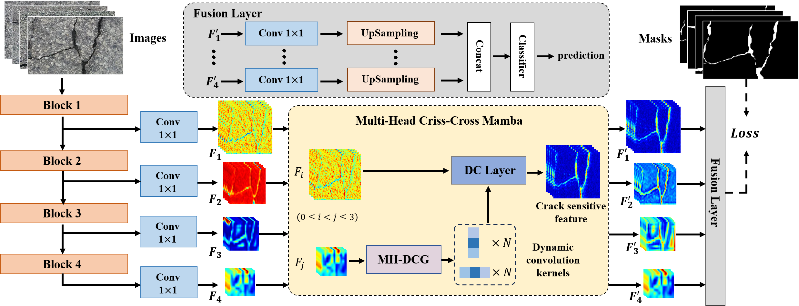

<p align="center">
  <h1 align="center">CCMamba: A Multi-Head Criss-Cross Mamba for Pavement Crack Segmentation</h1>
  <p align="center">

<p align="center">
<br />
    <strong>Binghao Liu</strong></a>
    ·
    <strong>Qi Zhao</strong></a>
    ·
    <strong>Chunlei Wang</strong></a>
    ·
    <strong>Hongbo Xie</strong></a>    
    ·
    <strong>Hong Zhang</strong></a>
    <br />
 </p>

## Introduction

This repo is the implementation of "CCMamba: A Multi-Head Criss-Cross Mamba for Pavement Crack Segmentation"

The overall architecture of Multi-Head Criss-Cross Mamba:

<p align="center">
  
</p>

The heatmap visualization of crack sensitive features:

<p align="left">
  
</p>

## Usage

### Install

Clone [MMSegmentation](https://github.com/open-mmlab/mmsegmentation) repo and add the codes of `configs`, `mmseg/datasets/crack500.py` and `mmseg/models/decode_heads/ccmamba_head.py` into corresding files of MMSegmentation.

Then, run
`pip install -v -e .`
to regist Crack500 dataset and CCMamba model.

### Train and Test

+ Use the following command for training
  
  ```
  python tools/train.py \
  config_path \
  --work-dir work_path
  ```

+ Use the following command for testing with TResNet-L
  
  ```
  python tools/test.py \
  config_path \
  ckpt_path \
  --work-dir work_path
  ```

## Citation

If you have any question, please discuss with me by sending email to liubinghao@buaa.edu.cn

## References

The code is based on [MMSegmentation](https://github.com/open-mmlab/mmsegmentation), [Mamba](https://github.com/state-spaces/mamba) and [mamba-minimal](https://github.com/johnma2006/mamba-minimal). Thanks for their great works!
