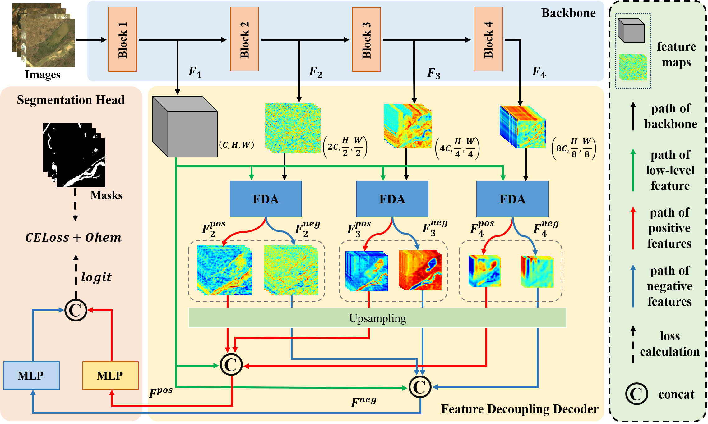

<p align="center">
  <h1 align="center">African water body segmentation with cross-layer information separability based feature decoupling transformer</h1>
  <p align="center">


   <br />
    <strong>Binghao Liu</strong></a>
    ·
    <strong>Qi Zhao</strong></a>
    ·
    <strong>Chunlei Wang</strong></a>
    ·
    <strong>Meng Li</strong></a>    
    ·
    <strong>Hongbo Xie</strong></a>    
    ·
    <strong>Lijiang Chen</strong></a>
    <br />
<p align="center">
 </p>


## Introduction
This repo is the implementation of "African water body segmentation with cross-layer information separability based feature decoupling transformer"

The data distribution and several examples of our AWS16K dataset.

<p align="center">
  
</p>

AWS16K contains 16888 water body images covering the whole African area.

The cross-layer information separability based Feature Decoupling Transformer:

<p align="center">
  
</p>

## Usage

### Install

Clone [MMSegmentation](https://github.com/open-mmlab/mmsegmentation) repo and [FDTran](https://github.com/BinghaoLiu/FDTran) repo, add the codes of `configs`, `mmseg/datasets/aws.py` and `mmseg/models/decode_heads/fdt_head.py` into corresponding files of MMSegmentation.

Then, run
`pip install -v -e .`
to regist AWS16K dataset and FDTran model.

### Dataset

Our AWS16K dataset can be found at [AWS16K](https://pan.baidu.com/s/1_YdbGiGYKNv-lfhd2C5KlA) (code: awbs), then you need to convert 255 pixels to 1 for training and testing.

### Train and Test

+ Use the following command for training

  ```
  python tools/train.py \
  config_path \
  --work-dir work_path
  ```

+ Use the following command for testing

  ```
  python tools/test.py \
  config_path \
  ckpt_path \
  --work-dir work_path
  ```

The pretrained weights of FDTran (with mit_b5 as backbone) can be found at [https://pan.baidu.com/s/1IOq96KEZdE4ytD6V6Irr-w](https://pan.baidu.com/s/1IOq96KEZdE4ytD6V6Irr-w) (code: fdt1).

## Citation

If you have any question, please discuss with me by sending email to liubinghao@buaa.edu.cn.
If you find this code useful please cite:
```
@article{LIU2025104741,
title = {African water body segmentation with cross-layer information separability based feature decoupling transformer},
journal = {International Journal of Applied Earth Observation and Geoinformation},
volume = {142},
pages = {104741},
year = {2025},
issn = {1569-8432},
doi = {https://doi.org/10.1016/j.jag.2025.104741}
author = {Binghao Liu and Qi Zhao and Chunlei Wang and Meng Li and Hongbo Xie and Lijiang Chen}
}
```

## References

The code is based on [MMSegmentation](https://github.com/open-mmlab/mmsegmentation). Thanks for their great works!
