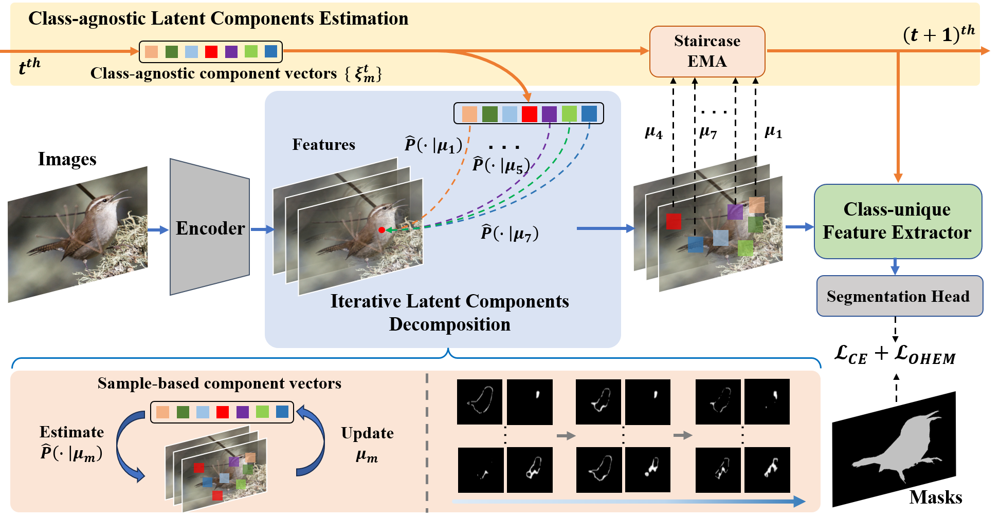
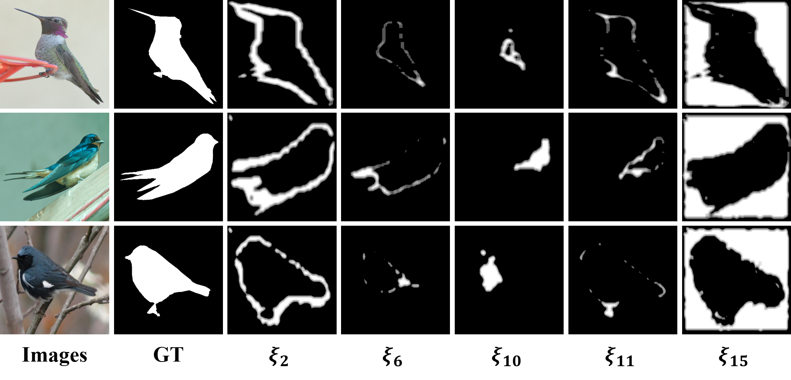

<p align="center">
  <h1 align="center">Fine-grained Segmentation via Latent Components Estimation and Decomposition</h1>
  <p align="center">

<p align="center">
<br />
    <strong>Binghao Liu</strong></a>
    ·
    <strong>Qi Zhao</strong></a>
    ·
    <strong>Yidi Bai</strong></a>
    ·
    <strong>Chunlei Wang</strong></a>    
    ·
    <strong>Hong Zhang</strong></a>
    <br />
 </p>

## Introduction

This repo is the implementation of "Fine-grained Segmentation via Latent Components Estimation and Decomposition"

The overall architecture of LCED:

<p align="center">
  
</p>

The component maps visualization of fine-grained birds:

<p align="center">
  
</p>

## Usage
### Dataset

CUB-seg dataset: Google Driver(https://drive.google.com/file/d/1qYX6wgbTcTHP9mjTMrxh466a8hLL_Q1g/view?usp=sharing), BaiduDisk(https://pan.baidu.com/s/1EYemJUt9PTNLB9KqgUMN7g, pw：dl7j)

### Install

Clone [MMSegmentation](https://github.com/open-mmlab/mmsegmentation) repo and add the codes of `configs`, `mmseg/datasets` and `mmseg/models/decode_heads` into corresponding files of MMSegmentation.

Then, run
`pip install -v -e .`
to regist CUB-seg dataset and LCED model.

### Train and Test

+ Use the following command for training
  
  ```
  python tools/train.py \
  config_path \
  --work-dir work_path
  ```

+ Use the following command for testing
  
  ```
  python tools/test.py \
  config_path \
  ckpt_path \
  --work-dir work_path
  ```

## Citation

If you have any question, please discuss with me by sending email to liubinghao@buaa.edu.cn

## References

The code is based on [MMSegmentation](https://github.com/open-mmlab/mmsegmentation). Thanks for their great works!

